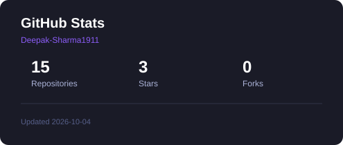
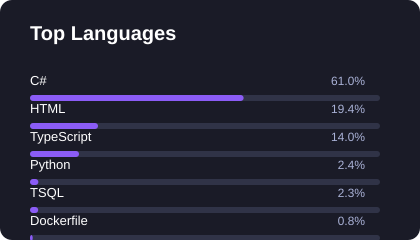

<h1 align="center">
  
</h1>

<p align="center">
  <strong>Building scalable backend systems, cloud applications, and production-ready software with .NET and Azure.</strong>
</p>

<p align="center">
  <a href="https://www.linkedin.com/in/deepak-sharma-49b9a715a">
    
  </a>
  <a href="mailto:itsdeepaksharma19@gmail.com">
    
  </a>
</p>

---

## 👨‍💻 About Me

```yaml
name: Deepak Sharma
role: Senior Software Engineer
experience: 6.5+ years
specialization: .NET Backend & Azure
currently: GlobalLogic

focus:
  - Backend Engineering
  - Cloud & Distributed Systems
  - System Design
  - API Development
  - AI Engineering
```

I'm a **.NET developer with 6.5+ years of experience** building and maintaining enterprise applications, APIs, integrations, and cloud-based systems.

My core focus is **C#, .NET, ASP.NET Core, Azure, SQL Server, and API development**, with hands-on experience across CI/CD, application modernization, production support, authentication, observability, and cloud services.

I enjoy understanding how systems work under the hood — from **API design and database performance to authentication, distributed systems, deployments, and production troubleshooting**.

Currently, I'm expanding my expertise into **AI engineering**, exploring **LLMs, RAG, MCP, AI agents, and AI-assisted software development**.

> Good software isn't just about writing code. It's about building systems that are maintainable, observable, scalable, and reliable.

---

## 🛠️ Tech Stack

<table>
  <tr>
    <td align="center" width="150"><strong>Backend</strong></td>
    <td>
      
      
      
      
      
    </td>
  </tr>

  <tr>
    <td align="center"><strong>Cloud</strong></td>
    <td>
      
      
      
      
    </td>
  </tr>

  <tr>
    <td align="center"><strong>Databases</strong></td>
    <td>
      
      
      
    </td>
  </tr>

  <tr>
    <td align="center"><strong>Frontend</strong></td>
    <td>
      
      
      
      
    </td>
  </tr>

  <tr>
    <td align="center"><strong>DevOps</strong></td>
    <td>
      
      
      
      
      
      
    </td>
  </tr>

  <tr>
    <td align="center"><strong>Architecture</strong></td>
    <td>
      
      
      
      
      
    </td>
  </tr>

  <tr>
    <td align="center"><strong>AI</strong></td>
    <td>
      
      
      
      
      
    </td>
  </tr>
</table>

---

## 🚀 Currently Exploring

* 🧠 **AI Engineering** — LLMs, RAG, AI Agents & MCP
* 🏗️ **System Design** — LLD, HLD & Distributed Systems
* ⚡ **Modern .NET** — .NET 8+, performance & architecture
* ☁️ **Azure Cloud** — Cloud-native application development
* 🔄 **Application Modernization** — Legacy .NET → modern platforms
* 🤖 **AI-assisted Development** — AI tools and engineering workflows

---

## 📌 Featured Project

### 📚 DevNoteStack

A developer-focused knowledge platform for **learning, revision, and organizing technical concepts**.

**Focus:** .NET • Angular • System Design • DSA • Software Engineering

<p align="center">
  <a href="https://devnotestack.netlify.app/">
    
  </a>
</p>

---

## 📊 GitHub Activity

<table align="center">
  <tr>
    <td align="center" valign="top">
      
    </td>
    <td align="center" valign="top">
      
    </td>
  </tr>
</table>

---

## 🤝 Let's Connect

<p align="center">
  <a href="https://www.linkedin.com/in/deepak-sharma-49b9a715a">
    
  </a>

  <a href="mailto:itsdeepaksharma19@gmail.com">
    
  </a>
</p>

<p align="center">
  <strong>Build. Learn. Improve. Repeat.</strong><br/>
  <sub>Always learning, always building.</sub>
</p>
